# 🚀 AI Marketing Chat Agent

A powerful conversational AI system for creating professional marketing campaigns with beautiful HTML emails, optimized images, and multi-channel delivery using LangGraph.

## ✨ Features

### 🤖 **Conversational Intelligence**
- **ChatGPT-like Interface**: Natural conversation with marketing expertise
- **Marketing Intent Detection**: Automatically identifies campaign requests
- **General Chat Support**: Handles non-marketing questions when enabled
- **Multi-language Support**: Works with various language inputs

### 📧 **Professional Email Generation**
- **Beautiful HTML Templates**: Mobile-responsive email designs
- **Image Optimization**: Automatically optimizes images for email delivery
- **Multi-format Support**: HTML + Plain Text versions
- **Embedded Images**: Campaign visuals included as email attachments
- **CTA Buttons**: Calls-to-action as styled, clickable buttons

### 🎨 **AI Content Creation**
- **Marketing Copy**: Compelling, audience-targeted content
- **Visual Generation**: High-quality campaign images via DALL-E
- **Hashtag Creation**: Relevant social media hashtags
- **CTA Generation**: Effective call-to-action phrases
- **Multi-channel Adaptation**: Content optimized per platform

### 📊 **Monitoring & Analytics**
- **Token Tracking**: LLM usage and cost monitoring
- **Performance Metrics**: Campaign generation timing
- **Beautiful Terminal Output**: Comprehensive progress and results display
- **LangSmith Integration**: Advanced observability and tracing

### 🚀 **Flexible Deployment**
- **Multiple Agents**: Full campaigns vs. micro-focused agents
- **Testing Infrastructure**: Unit, integration, and QA test suites
- **Development Tools**: Fast iteration and debugging workflows
- **Backwards Compatibility**: Zero-impact feature additions

## 🛠️ Setup

### Prerequisites
- Python 3.9+
- OpenAI API key
- Optional: PIL/Pillow for image optimization

### Installation
```bash
# Clone the repository
git clone <repository-url>
cd marketing-chat-agent

# Install dependencies
pip install -r requirements.txt

# Set up environment variables
cp .env.example .env
# Edit .env with your configuration
```

## ⚙️ Configuration

Create a `.env` file with these settings:

### **🔑 Required Settings**
```env
# OpenAI API Configuration
OPENAI_API_KEY=your_openai_api_key_here

# Basic Operation Mode
DRY_RUN=true                    # true=save files, false=real actions
```

### **📧 Email Configuration**
```env
# Email Channel Control
ENABLE_EMAIL=true               # Enable/disable email channel

# HTML Email Features (New!)
ENABLE_HTML_EMAIL=false         # Enable beautiful HTML emails
ENABLE_EMAIL_TEMPLATES=false    # Use rich email templates
ENABLE_IMAGE_OPTIMIZATION=false # Optimize images for email

# SMTP Settings (for real email sending)
EMAIL_SMTP_HOST=smtp.gmail.com
EMAIL_SMTP_PORT=587
EMAIL_USE_TLS=true
EMAIL_USERNAME=your-email@gmail.com
EMAIL_PASSWORD=your-app-password
EMAIL_FROM=your-email@gmail.com
EMAIL_TO=recipient@example.com
```

### **🎭 Chat Behavior**
```env
# Conversational Features
ENABLE_GENERAL_CHAT=true        # Enable ChatGPT-like conversation
```

### **📱 Multi-channel Support**
```env
# Social Media Channels
ENABLE_INSTAGRAM=false          # Instagram posting
ENABLE_FACEBOOK=false           # Facebook posting
ENABLE_TWITTER=false            # Twitter posting
ENABLE_LINKEDIN=false           # LinkedIn posting
```

### **🔧 Advanced Settings**
```env
# Model Configuration
LLM_MODEL=gpt-4o                # OpenAI model to use
IMAGE_MODEL=dall-e-3            # Image generation model
LLM_TEMPERATURE=0.7             # Creativity level (0.0-1.0)

# Paths
IMAGE_OUTPUT_DIR=static/images  # Image storage location
OUTBOX_DIR=data/outbox          # Email output location

# Observability
LANGSMITH_API_KEY=your_key      # Optional: LangSmith tracing
```

## 🎯 Usage Commands

### **💬 Interactive Chat Agents**

#### **Full Marketing Agent** (Complete Campaigns)
```bash
# Create complete marketing campaigns with images
python -m runnables.chat_full_marketing_agent

# Example usage:
# User: "promote gaming headsets to teenagers on Instagram and email"
# Result: Marketing copy + image + hashtags + CTAs + delivery
```

#### **Fast Marketing Agent** (Quick Content)
```bash
# Rapid campaign generation (no images, faster)
python -m runnables.chat_fast_marketing_agent

# Example usage:
# User: "create valentine's campaign for restaurants"
# Result: Marketing copy + hashtags + CTAs + delivery (6-8 seconds)
```

### **🎯 Micro Agents** (Focused Tasks)

#### **Text-Only Agent**
```bash
# Generate only marketing copy
python -m runnables.chat_text_agent_micro

# Use case: Quick copywriting, A/B testing content
```

#### **Image-Only Agent**
```bash
# Generate only campaign images
python -m runnables.chat_image_agent

# Use case: Visual content creation, image variations
```

#### **Hashtag-Only Agent**
```bash
# Generate only hashtags and CTAs
python -m runnables.chat_hashtag_agent

# Use case: Social media optimization, hashtag research
```

### **📊 Testing & Development**

#### **Quick Development Tests**
```bash
# Fast feedback loop for developers
make test-dev

# Or manually:
python tests/dev_test_runner.py
```

#### **Comprehensive Testing**
```bash
# Run all test suites
make test                       # Unit + Integration tests
make test-unit                  # Micro agent tests only
make test-integration          # Full workflow tests
make test-qa                   # Production readiness tests
```

#### **Smoke Tests**
```bash
# Quick system health check
make test-smoke

# Verify basic functionality
python tests/run_tests.py --mode smoke
```

### **🧹 Utility Commands**

#### **Environment Management**
   ```bash
# Set up test environment
make setup

# Clean up generated files
make clean

# Performance testing
make test-perf
```

## 📧 HTML Email Features

### **Enable Beautiful Emails**
   ```bash
# Enable HTML email templates with image optimization
ENABLE_HTML_EMAIL=true \
ENABLE_EMAIL_TEMPLATES=true \
ENABLE_IMAGE_OPTIMIZATION=true \
python -m runnables.chat_full_marketing_agent
```

### **Generated Email Content**
When HTML emails are enabled, you get:
- **📧 email_post.html**: Beautiful responsive email template
- **📝 email_post.txt**: Plain text fallback version
- **🖼️ campaign_image_optimized.jpg**: Email-optimized image (600x400, ~300KB)

### **Email Features**
- **Mobile-responsive** design
- **Embedded campaign images**
- **Styled CTA buttons**
- **Professional branding**
- **Hashtags as styled tags**

## 🏗️ Architecture

### **Agent Hierarchy**
```
agents/
├── core/           # Base agent classes
├── micro/          # Single-purpose agents (text, image, hashtags)
└── campaign/       # Full marketing campaign orchestration
```

### **Node-Based Processing**
```
nodes/
├── intent/         # User input parsing and understanding
├── generation/     # Content creation (text, images, CTAs)
├── compose/        # Response assembly and formatting
└── delivery/       # Multi-channel content distribution
```

### **Workflow Overview**

```mermaid
graph TD
    A[👤 User Input] --> B[🧠 Parse Intent]
    B --> C[🎨 Creative Generation]
    C --> D{Content Creation}
    D --> E[📝 Text Generation]
    D --> F[🖼️ Image Generation]
    D --> G[🏷️ Hashtag/CTA Generation]
    E --> H[📦 Response Composition]
    F --> H
    G --> H
    H --> I[🚀 Multi-channel Delivery]
    I --> J[📧 Email]
    I --> K[📱 Social Media]
    I --> L[📁 File Output]
```


### **Enhanced Email Pipeline**

```mermaid
graph TD
    A[📝 Marketing Content] --> B{HTML Enabled?}
    B -->|No| C[📄 Plain Text Email]
    B -->|Yes| D[🎨 HTML Template Engine]
    D --> E[🖼️ Image Optimization]
    E --> F[📧 Multi-part Email]
    F --> G[💾 Outbox Files]
    F --> H[📮 SMTP Delivery]
```


## 📁 Project Structure
```
marketing-chat-agent/
├── src/
│   ├── agents/           # Agent implementations
│   ├── graphs/           # LangGraph workflow definitions
│   ├── nodes/            # Processing units
│   ├── providers/        # External service integrations
│   ├── templates/        # HTML email templates
│   ├── utils/            # Utility functions
│   └── config/           # Configuration management
├── runnables/            # Interactive chat interfaces
├── tests/                # Test suites (unit, integration, QA)
├── data/outbox/          # Generated campaign files
├── static/images/        # Generated campaign images
└── Makefile             # Development commands
```

## 🧪 Development Workflow

### **Quick Start Development**
```bash
# 1. Set up environment
make setup

# 2. Run development tests
make test-dev

# 3. Test interactive agent
DRY_RUN=true python -m runnables.chat_fast_marketing_agent

# 4. Enable HTML emails for testing
ENABLE_HTML_EMAIL=true DRY_RUN=true python -m runnables.chat_full_marketing_agent
```

### **Testing Strategy**
- **💨 Smoke Tests**: Basic functionality verification
- **🔬 Unit Tests**: Individual component testing
- **🔗 Integration Tests**: End-to-end workflow validation
- **⚡ Dev Tests**: Fast developer feedback loop
- **🔍 QA Tests**: Production readiness validation

## 🎨 Example Outputs

### **Generated Campaign Files**
```
data/outbox/promote_headsets_1754965633/
├── email_post.html          # Beautiful HTML email (6KB)
├── email_post.txt           # Plain text version (300B)
└── campaign_image_optimized.jpg  # Optimized image (300KB)
```

### **Terminal Output**
```
🎬 Step 1/7: Parsing your request...
🎨 Step 2/7: Generating creative brief...
🔀 Step 3/7: Creating content in parallel...
     📝 Writing compelling copy...
     🎨 Creating visual content...
     🏷️ Generating hashtags & CTAs...
🎭 Step 4/7: Composing campaign...
🚀 Step 5/7: Executing delivery...

✅ CAMPAIGN CREATION COMPLETED!

📊 PERFORMANCE & MONITORING
═══════════════════════════════════════
🤖 LLM Usage Summary:
   • Total Calls: 5
   • Total Tokens: 2,847 (Input: 1,923, Output: 924)
   • Primary Model: gpt-4o
   • Cost Estimate: $0.05

🖼️ Image Generation:
   • Generated: gaming_headsets_campaign.png
   • Size: 1024x1024 → 600x400 (optimized)
   • Compression: 82% smaller for email

📬 Delivery Performance:
   • Email: ✅ HTML template with image
   • Instagram: ✅ Content prepared
   • Processing Time: 24.3 seconds
```

## 🔧 Troubleshooting

### **Common Issues**

#### **Email Not Sending**
```bash
# Check configuration
DRY_RUN=true ENABLE_EMAIL=true python -c "
from src.config import get_config
cfg = get_config()
print(f'Email enabled: {cfg.enable_email}')
print(f'DRY_RUN: {cfg.dry_run}')
"
```

#### **Images Not Generating**
```bash
# Test image generation
python -m runnables.chat_image_agent
# Input: "test image generation"
```

#### **HTML Emails Not Working**
```bash
# Verify HTML features
ENABLE_HTML_EMAIL=true python -c "
from src.config import get_config
cfg = get_config()
print(f'HTML email: {cfg.enable_html_email}')
print(f'Templates: {cfg.enable_email_templates}')
"
```

## 🚀 Production Deployment

### **Production-Ready Configuration**
```env
# Production settings
DRY_RUN=false
ENABLE_EMAIL=true
ENABLE_HTML_EMAIL=true
ENABLE_EMAIL_TEMPLATES=true
ENABLE_IMAGE_OPTIMIZATION=true

# Real email credentials
EMAIL_SMTP_HOST=smtp.gmail.com
EMAIL_USERNAME=production@company.com
EMAIL_PASSWORD=secure-app-password
```

### **Pre-deployment Testing**
```bash
# Run comprehensive QA tests
make test-qa

# Test production configuration
DRY_RUN=false python tests/qa_test_runner.py
```

## 📚 Additional Resources

### **Development Commands Reference**
```bash
# Environment setup
make setup                    # Initialize test environment
make clean                    # Clean generated files

# Testing commands
make test-smoke              # Quick health check
make test-dev                # Fast development tests  
make test-unit               # Micro agent unit tests
make test-integration        # Full workflow tests
make test-qa                 # Production readiness
make test                    # All tests (unit + integration)

# Performance
make test-perf               # Performance benchmarking
```

### **Configuration Examples**

#### **Development Mode** (Safe Testing)
```env
DRY_RUN=true
ENABLE_EMAIL=true
ENABLE_HTML_EMAIL=false
ENABLE_GENERAL_CHAT=true
```

#### **Enhanced Features** (Beautiful Emails)
```env
DRY_RUN=true
ENABLE_EMAIL=true
ENABLE_HTML_EMAIL=true
ENABLE_EMAIL_TEMPLATES=true
ENABLE_IMAGE_OPTIMIZATION=true
```

#### **Production Ready** (Real Delivery)
```env
DRY_RUN=false
ENABLE_EMAIL=true
ENABLE_HTML_EMAIL=true
EMAIL_USERNAME=your-production-email@gmail.com
EMAIL_PASSWORD=your-secure-app-password
```

## 🤝 Contributing

1. Fork the repository
2. Create a feature branch
3. Run tests: `make test-dev`
4. Submit a pull request

## 📝 License

MIT License - see LICENSE file for details

## 📞 Support

For questions and support:
- Create an issue in this repository
- Check the troubleshooting section above
- Review configuration examples for common setups