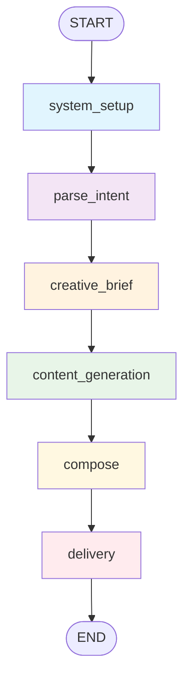

# 🚀 Full Marketing Agent - Complete Flow Documentation

## Overview
This document explains the complete execution flow of `python runnables/chat_full_marketing_agent.py` from start to finish, including every component, node, and decision point.

## 📂 High-Level Architecture

```
User Input → Marketing Detection → Intent Parsing → Graph Execution → Content Generation → Delivery → Results Display
```

---

## 1. 🎯 Application Entry Point

### File: `runnables/chat_full_marketing_agent.py`

```python
def main():
    print_banner("🚀 Full Marketing Campaign Agent")
    agent = FullMarketingAgent()  # Initialize the agent
    
    while True:  # Main interaction loop
        user_input = input("👤 User: ").strip()
        
        if is_marketing_request(user_input):
            # MARKETING FLOW
        else:
            # CONVERSATIONAL FLOW
```

### Key Components:
- **Banner Display**: Shows application title and instructions
- **Agent Initialization**: Creates `FullMarketingAgent()` instance
- **Interactive Loop**: Continuously processes user input
- **Input Classification**: Determines if input is marketing or conversational

---

## 2. 🔍 Marketing Request Detection

### Function: `is_marketing_request(user_input: str) -> bool`

**Purpose**: Classify user input as marketing-related or general conversation

**Detection Logic**:
1. **Keyword Matching**: 
   ```python
   marketing_keywords = [
       "promote", "promoto", "promte", "promo", "marketing", "market", 
       "campaign", "advertise", "sell", "launch", "announce", "brand"
       # ... 30+ marketing terms including typos
   ]
   ```

2. **Pattern Recognition**:
   ```python
   marketing_patterns = [
       "create campaign", "make ad", "want to promote", 
       "on instagram", "on facebook", "for diwali", "new year"
   ]
   ```

3. **Action + Product Combinations**:
   ```python
   action_words = ["lets", "help", "create", "make", "build"]
   product_indicators = ["tags", "post", "content", "ad", "campaign"]
   ```

**Return**: `True` if marketing request, `False` if conversational

---

## 3. 📝 Intent Parsing & Information Display

### If Marketing Request Detected:

```python
state: MessagesState = {"messages": [HumanMessage(content=user_input)]}

# Parse intent FIRST to show user what we understood
parsed_state = parse_intent_node(state)
parsed_intent = parsed_state.get("parsed_intent", {})

# Show what we understood before execution
print("🤖 Assistant: I understand you want to:")
print_kv("📝 Goal", parsed_intent.get("goal", "Not specified"))
print_kv("🎯 Audience", parsed_intent.get("audience", "Not specified"))
print_kv("📱 Channels", ", ".join(parsed_intent.get("channels", [])))
print_kv("🎨 Tone", parsed_intent.get("tone", "Not specified"))
print_kv("💰 Budget", parsed_intent.get("budget", "Not specified"))
```

### Purpose:
- **Transparency**: User sees what the system understood
- **Verification**: Allows user to spot parsing errors early
- **Confidence**: Builds trust before expensive operations

---

## 4. 🤖 Agent Execution

### Core Agent Class: `src/agents/campaign/full_marketing_agent.py`

```python
class FullMarketingAgent(BaseAgent):
    def __init__(self):
        super().__init__()
        self.graph = get_full_marketing_graph()  # Load the workflow graph

    def run(self, state: MessagesState) -> MessagesState:
        return self.graph.invoke(state)  # Execute the graph
```

**The agent is a wrapper around a LangGraph workflow that orchestrates the entire marketing campaign generation process.**

---

## 5. 📊 LangGraph Workflow Execution

### Graph Definition: `src/graphs/campaign/text_campaign_graph.py`



### Graph Flow:
1. **system_setup** → 2. **parse_intent** → 3. **creative_brief** → 4. **content_generation** → 5. **compose** → 6. **delivery** → **END**

**Note**: Review step is currently disabled (`content_generation` → `compose` directly)

---

## 6. 🔧 Individual Node Execution

### Node 1: **system_setup**
**File**: `text_campaign_graph.py` (internal function)
**Purpose**: Add marketing system prompt to messages
**Input**: Raw user state
**Process**:
```python
def add_marketing_system(state: MessagesState) -> MessagesState:
    # Check if system message exists
    # Try to load from src/prompts/marketing_system_prompt.md
    # Add SystemMessage to beginning of conversation
    # Return updated state
```
**Output**: State with system prompt added

---

### Node 2: **parse_intent** 
**File**: `src/nodes/intent/parse_intent_node.py`
**Purpose**: Extract campaign parameters from user input
**Input**: User message + system prompt
**Process**:
- **Goal Extraction**: "promote fitness tracker" → goal: "promote fitness tracker"
- **Audience Detection**: "to tech professionals" → audience: "tech professionals"  
- **Channel Parsing**: "on linkedin email" → channels: ["Linkedin", "Email"]
- **Tone Analysis**: Context analysis → tone: "professional"
- **Budget Detection**: "$800 budget" → budget: "$800"
- **LLM Fallback**: If regex fails, use LLM to extract intent

**Output**: State with `parsed_intent` object containing all extracted parameters

---

### Node 3: **creative_brief**
**File**: `src/nodes/intent/creative_generation_node.py`
**Purpose**: Generate creative direction and strategy
**Input**: Parsed intent
**Process**:
- Analyze target audience psychology
- Define creative approach and messaging strategy
- Set visual and tonal guidelines
- Create campaign positioning

**Output**: State with `creative_brief` containing strategic direction

---

### Node 4: **content_generation**
**File**: `text_campaign_graph.py` (internal function)
**Purpose**: Generate all marketing content in parallel
**Process**:
```python
def generate_all_content(state: MessagesState) -> MessagesState:
    state = text_generation_node(state)    # Generate marketing copy
    state = image_generation_node(state)   # Generate visual content  
    state = cta_hashtag_node(state)        # Generate hashtags & CTAs
    return state
```

#### Sub-Node 4a: **text_generation_node**
**File**: `src/nodes/generation/text/text_generation_node.py`
**Purpose**: Generate compelling marketing copy
**Input**: Creative brief + parsed intent
**Process**:
- Use GPT-4 to create marketing copy
- Incorporate audience, tone, and channel requirements
- Follow creative brief guidelines
- Generate platform-appropriate length and style

**Output**: State with `post_content` containing marketing copy

#### Sub-Node 4b: **image_generation_node**
**File**: `src/nodes/generation/image/image_generation_node.py`  
**Purpose**: Generate marketing visuals using DALL-E
**Input**: Marketing copy + creative brief
**Process**:
- Create detailed image prompt based on campaign
- Call DALL-E API to generate image
- Save image to `static/images/generated_[timestamp].png`
- Store image metadata (model, prompt, path)

**Output**: State with `image_url` and `image_prompt`

#### Sub-Node 4c: **cta_hashtag_node**
**File**: `src/nodes/generation/cta_hashtag/cta_hashtag_node.py`
**Purpose**: Generate hashtags and call-to-action phrases
**Input**: Marketing copy + parsed intent
**Process**:
- Generate relevant hashtags for discoverability
- Create compelling call-to-action phrases
- Ensure brand consistency and platform optimization

**Output**: State with `hashtags` (list) and `ctas` (list)

---

### Node 5: **compose**
**File**: `src/nodes/compose/response_generator_node.py`
**Purpose**: Package all content into deliverable formats
**Input**: All generated content (text, image, hashtags, CTAs)
**Process**:
```python
def response_generator_node(state: MessagesState) -> MessagesState:
    # Build social media posts for each channel
    social_media_posts = _build_social_posts(parsed_intent, post_content, hashtags, image_url)
    
    # Build email content
    email = _build_email(parsed_intent, post_content, ctas, image_url)
    
    # Create final response structure
    final_response = {
        "socialMediaPosts": social_media_posts,
        "email": email,
        "creativeBrief": creative_brief,
        "artifacts": artifacts
    }
```

**Key Logic**:
- **Channel Detection**: Uses same logic as `sender_node` to determine target channels
- **Content Adaptation**: Formats content appropriately for each platform
- **Email Structure**: Creates subject line and body text
- **Social Posts**: One post per requested channel with platform-specific formatting

**Output**: State with `final_response` containing packaged content for all channels

---

### Node 6: **delivery**
**File**: `text_campaign_graph.py` (internal function)
**Purpose**: Execute delivery to all requested channels
**Process**:
```python
def execute_delivery(state: MessagesState) -> MessagesState:
    # Route to delivery channels
    state = sender_node(state)
    
    # Execute delivery to all requested channels
    requested_channels = state.get("delivery", {}).get("requested", [])
    
    for channel in requested_channels:
        if channel_key in CHANNELS:
            delivery_node = CHANNELS[channel_key]
            state = delivery_node(state)
```

#### Sub-Node 6a: **sender_node**
**File**: `src/nodes/delivery/decider/sender_node.py`
**Purpose**: Determine which channels to deliver to
**Logic**:
```python
def _route_channels(state: MessagesState) -> List[str]:
    cfg = get_config()
    requested = []
    
    # Get explicitly requested channels from parsed intent
    intent = state.get("parsed_intent", {})
    for ch in intent.get("channels", []):
        requested.append(ch.strip().title())
    
    # If no channels specified, use ALL enabled channels
    if not requested:
        if cfg.enable_email: requested.append("Email")
        if cfg.enable_facebook: requested.append("Facebook")
        if cfg.enable_instagram: requested.append("Instagram")
        if cfg.enable_twitter: requested.append("Twitter")
        if cfg.enable_linkedin: requested.append("LinkedIn")
    
    # Filter by available and enabled channels
    return allowed_channels
```

**Output**: State with `delivery` object containing requested channels

#### Sub-Node 6b: **Channel Delivery Nodes**
**Registry**: `src/registries/channels.py`
```python
CHANNELS: Dict[str, ChannelCallable] = {
    "email": send_email_node,
    "instagram": send_instagram_node, 
    "facebook": send_facebook_node,
    # "twitter": send_twitter_node,      # TODO: implement
    # "linkedin": send_linkedin_node,    # TODO: implement
}
```

##### **send_email_node**
**File**: `src/nodes/delivery/email/send_email_node.py`
**Purpose**: Send/save email content
**Process**:
1. **Provider Selection**:
   ```python
   use_oauth = os.getenv("USE_OAUTH_GMAIL", "false").lower() == "true"
   
   if use_oauth:
       # Use OAuth Gmail provider (most secure)
       OAuthGmailProvider().send(...)
   elif cfg.enable_html_email or cfg.enable_email_templates:
       # Use Enhanced SMTP provider for HTML emails
       EnhancedSMTPProvider().send(...)
   else:
       # Use Standard SMTP provider (plain text)
       SMTPProvider().send(...)
   ```

2. **DRY_RUN Handling**:
   - **DRY_RUN=true**: Save email content to `data/outbox/[campaign]/email_post.html` and `email_post.txt`
   - **DRY_RUN=false**: Send real email via SMTP/OAuth

**Output**: State with delivery status in `delivery.results.email`

##### **send_instagram_node**
**File**: `src/nodes/delivery/instagram/send_instagram_node.py`
**Purpose**: Save Instagram post content
**Process**:
- Extract Instagram post from `final_response.socialMediaPosts`
- Save to `data/outbox/[campaign]/instagram_post.txt`
- Include text content, hashtags, and image reference

**Output**: State with delivery status in `delivery.results.instagram`

##### **send_facebook_node**
**File**: `src/nodes/delivery/facebook/send_facebook_node.py`  
**Purpose**: Save Facebook post content
**Process**: Similar to Instagram, saves to `facebook_post.txt`

**Output**: State with delivery status in `delivery.results.facebook`

---

## 7. 📁 File System Output

### Outbox Structure:
```
data/outbox/
└── [campaign_name]_[timestamp]/
    ├── email_post.html          # Beautiful HTML email (if HTML enabled)
    ├── email_post.txt           # Plain text email backup
    ├── facebook_post.txt        # Facebook post content
    ├── instagram_post.txt       # Instagram post content  
    └── campaign_image_optimized.jpg  # Optimized image (if applicable)

static/images/
└── generated_[timestamp].png    # Original AI-generated image
```

### Campaign Folder Naming:
**Function**: `src/utils/common.py` → `create_campaign_folder()`
**Format**: `[goal_words]_[timestamp]`
**Example**: `promote_fitness_trac_1754974462`

---

## 8. 📊 Results Display & Monitoring

### Main Summary Function: `print_campaign_summary(result: MessagesState)`

#### 8.1 Campaign Overview
```python
print_colored("🎯 CAMPAIGN OVERVIEW", "36")
print_kv("Goal", parsed_intent.get("goal"))
print_kv("Audience", parsed_intent.get("audience"))  
print_kv("Channels", ", ".join(parsed_intent.get("channels")))
print_kv("Tone", parsed_intent.get("tone"))
print_kv("Budget", parsed_intent.get("budget"))
```

#### 8.2 Generated Content
```python
print_colored("📝 GENERATED CONTENT", "33")
print_kv("✅ Marketing Copy", post_content)
print_kv("🏷️ Hashtags", " ".join(hashtags))
print_kv("📢 CTAs", ", ".join(ctas))
print_kv("🖼️ Generated Image", image_url)
```

#### 8.3 Delivery Results  
```python
print_colored("📱 DELIVERY RESULTS", "32")
print_kv("Requested Channels", ", ".join(requested))

for channel, status in delivery_results.items():
    status_icon = "✅" if "Successfully" in status else "❌"
    print_kv(f"{status_icon} {channel.title()}", status)
```

#### 8.4 Performance Monitoring
**Function**: `print_monitoring_summary(result: MessagesState)`

```python
print_colored("📊 PERFORMANCE & MONITORING", "36")

# LLM Usage Summary
for call_name, data in llm_calls.items():
    print(f"  • {display_name}: {model}")
    print(f"    └─ {total_tokens} tokens ({input_tokens} in + {output_tokens} out)")

# Image Generation Details
print(f"  • Model: {image_model}")
print(f"  • Generated File: {filename}")
print(f"  • Revised Prompt: {revised_prompt[:100]}...")

# Delivery Performance  
print(f"  • Channels Delivered: {delivered_count}/{total_channels}")
print(f"  • Success Rate: {success_rate:.1f}%")
```

---

## 9. 🔄 Alternative Flow: Conversational Chat

### If NOT Marketing Request:

```python
else:
    cfg = get_config()
    
    if cfg.enable_general_chat:
        # Use real LLM for general conversation
        chat_state = MessagesState()
        chat_state["messages"] = [HumanMessage(content=user_input)]
        llm_result = llm_node(chat_state)
        print(llm_result["messages"][-1].content)
    else:
        # Use hardcoded marketing-focused responses  
        response = chat_response(user_input)
        print(response)
```

### Chat Response Logic:
**Function**: `chat_response(user_input: str) -> str`

- **Greetings**: "hi", "hello" → Marketing agent introduction
- **Help**: "help", "what can you do" → Capabilities explanation  
- **Thanks**: "thanks", "awesome" → Encouraging response
- **Default**: Marketing-focused redirect message

---

## 10. 🛠️ State Management

### MessagesState Structure:
**File**: `src/utils/state.py`

```python
class MessagesState(TypedDict, total=False):
    messages: Annotated[list[BaseMessage], add_messages]
    
    # Core content fields
    post_content: Optional[str]
    hashtags: Optional[List[str]]
    ctas: Optional[List[str]]
    image_url: Optional[str]
    image_prompt: Optional[str]
    
    # Intent and planning
    parsed_intent: Optional[Dict[str, Any]]
    creative_brief: Optional[str]
    
    # Response composition
    final_response: Optional[Dict[str, Any]]
    
    # Delivery tracking
    delivery: Optional[Dict[str, Any]]
    
    # Metadata
    meta: Optional[Dict[str, Any]]
    llmMetadata: Optional[Dict[str, Any]]
```

### State Flow Through Graph:
1. **Initial**: `{"messages": [HumanMessage(user_input)]}`
2. **After parse_intent**: `+ parsed_intent`
3. **After creative_brief**: `+ creative_brief`  
4. **After content_generation**: `+ post_content, image_url, hashtags, ctas`
5. **After compose**: `+ final_response`
6. **After delivery**: `+ delivery`

---

## 11. 🔧 Configuration & Environment

### Key Environment Variables:
```bash
# Core functionality
OPENAI_API_KEY=sk-...
DRY_RUN=true                    # false for real email sending
ENABLE_GENERAL_CHAT=true        # Enable conversational responses

# Channel enablement  
ENABLE_EMAIL=true
ENABLE_FACEBOOK=true
ENABLE_INSTAGRAM=true
ENABLE_TWITTER=false
ENABLE_LINKEDIN=false

# Email provider selection
USE_OAUTH_GMAIL=false           # true for OAuth, false for SMTP
ENABLE_HTML_EMAIL=true          # Rich HTML email templates
ENABLE_EMAIL_TEMPLATES=true     # Jinja2 template rendering
ENABLE_IMAGE_OPTIMIZATION=true  # Optimize images for email

# SMTP Configuration (if not using OAuth)
EMAIL_SMTP_HOST=smtp.gmail.com
EMAIL_USERNAME=your_email@gmail.com
EMAIL_PASSWORD=your_app_password
EMAIL_FROM=your_email@gmail.com
EMAIL_TO=recipient@example.com
```

---

## 12. 🚨 Error Handling & Fallbacks

### LLM Node Failures:
- **Timeout**: Retry with shorter prompt
- **Rate Limit**: Wait and retry
- **Invalid Response**: Use fallback content

### Image Generation Failures:
- **DALL-E Error**: Continue without image
- **File Save Error**: Log error, continue workflow

### Delivery Failures:
- **Missing Provider**: Show error message, continue other channels
- **SMTP Error**: Fall back to DRY_RUN mode
- **OAuth Error**: Fall back to SMTP provider

### State Corruption:
- **Missing Fields**: Use default values
- **Invalid Format**: Reset to empty and continue

---

## 13. 🔍 Monitoring & Observability

### LangSmith Integration:
**Decorator**: `@traceable(name="Node Name")`
- Tracks execution time for each node
- Records input/output state
- Captures errors and exceptions
- Provides performance analytics

### Token Usage Tracking:
```python
# Captured for each LLM call:
{
    "model": "gpt-4o",
    "input_tokens": 150,
    "output_tokens": 75,
    "total_tokens": 225
}
```

### Performance Metrics:
- **Total Execution Time**: ~25-30 seconds for full flow
- **LLM Calls**: 4-5 per campaign (intent, creative, text, hashtags, CTAs)
- **Token Usage**: 400-600 tokens per campaign
- **Success Rate**: Channel delivery success percentage

---

## 14. 🎯 Example Complete Flow

### Input:
```
User: "promote fitness tracker on instagram email for health enthusiasts with $500 budget"
```

### Execution Trace:
1. **Marketing Detection**: ✅ "promote", "fitness tracker" → Marketing request
2. **Intent Display**: 
   - Goal: "promote fitness tracker"
   - Audience: "health enthusiasts"  
   - Channels: "Instagram, Email"
   - Budget: "$500"
3. **Graph Execution**:
   - `system_setup` → Add marketing system prompt
   - `parse_intent` → Extract campaign parameters (already done)
   - `creative_brief` → Generate strategy for health enthusiast audience
   - `content_generation`:
     - `text_generation_node` → "🌟 Elevate your fitness journey..."
     - `image_generation_node` → Generate fitness tracker visual
     - `cta_hashtag_node` → Generate #FitLife hashtags and CTAs
   - `compose` → Package into Instagram post + Email format
   - `delivery`:
     - `sender_node` → Route to Instagram + Email channels
     - `send_instagram_node` → Save instagram_post.txt
     - `send_email_node` → Save email_post.html + email_post.txt
4. **Results Display**: Show complete campaign summary with monitoring data

### Output Files:
```
data/outbox/promote_fitness_trac_1754974462/
├── email_post.html
├── email_post.txt  
└── instagram_post.txt

static/images/
└── generated_1754974460.png
```

### Terminal Summary:
- ✅ Instagram: Successfully delivered
- ✅ Email: Successfully delivered  
- 📊 507 tokens used across 4 LLM calls
- 🖼️ 1.1MB image generated
- 📬 Success Rate: 100% (2/2 channels)

---

## 15. 🚀 Performance Characteristics

### Timing Breakdown:
- **Intent Parsing**: ~2 seconds
- **Creative Brief**: ~3 seconds  
- **Text Generation**: ~4 seconds
- **Image Generation**: ~15-20 seconds (bottleneck)
- **Hashtag/CTA Generation**: ~3 seconds
- **Compose & Delivery**: ~2 seconds
- **Total**: ~25-30 seconds

### Resource Usage:
- **Memory**: ~100MB peak (image processing)
- **Disk**: ~1-2MB per campaign (images + text files)
- **Network**: ~5-10 API calls per campaign
- **Token Cost**: ~$0.01-0.05 per campaign (depending on content length)

### Scalability Considerations:
- **Bottleneck**: DALL-E image generation (15-20s)
- **Parallelization**: Content generation steps could be parallelized further
- **Caching**: Generated images could be cached/reused for similar campaigns
- **Rate Limits**: OpenAI API limits may affect high-volume usage

---

This completes the comprehensive flow documentation for the Full Marketing Agent. The system demonstrates a sophisticated multi-step AI workflow that transforms natural language input into complete, multi-channel marketing campaigns with rich content, visual assets, and organized delivery.
