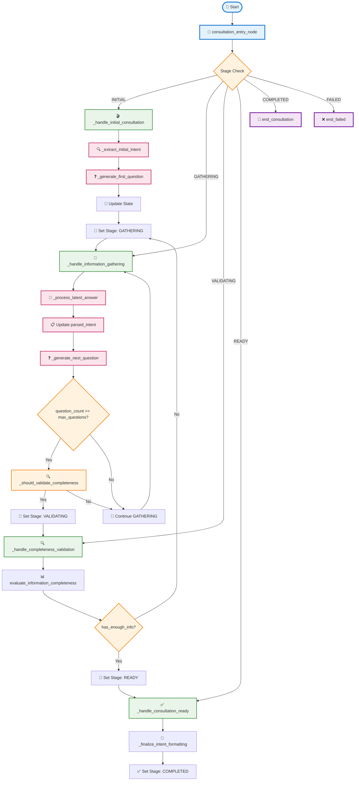
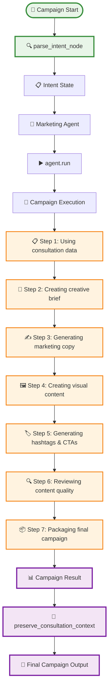
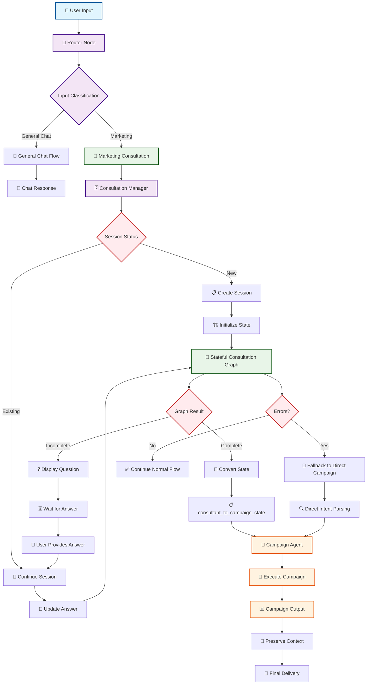

# 🔧 LangGraph Implementation - Technical Architecture

## 🎯 Stateful Marketing Consultation Graph



## 🔄 Campaign Generation Graph



## 🏗️ Complete System Integration



## 🔧 Technical Implementation Details

### **Stateful Consultation Graph Nodes**

1. **`consultation_entry_node`** 🚪
   - **Purpose**: Entry point for all consultation flows
   - **Logic**: Routes based on current stage
   - **Output**: Updated state with next stage

2. **`_handle_initial_consultation`** 🎬
   - **Purpose**: Handles first-time consultation requests
   - **Actions**: Extracts intent, generates first question
   - **State**: Sets stage to `GATHERING`

3. **`_handle_information_gathering`** 📝
   - **Purpose**: Manages ongoing question-answer flow
   - **Actions**: Processes answers, generates next questions
   - **Logic**: Tracks question count and completeness

4. **`_handle_completeness_validation`** 🔍
   - **Purpose**: Evaluates if enough information gathered
   - **Method**: Uses LLM-based completeness evaluator
   - **Decision**: Continue gathering or mark as ready

5. **`_handle_consultation_ready`** ✅
   - **Purpose**: Finalizes consultation state
   - **Actions**: Formats intent, prepares for campaign
   - **Output**: Sets stage to `COMPLETED`

### **Conditional Edge Logic**

1. **Stage-Based Routing**:
   ```python
   if state.stage == ConsultationStage.INITIAL:
       return "initial_consultation"
   elif state.stage == ConsultationStage.GATHERING:
       return "information_gathering"
   elif state.stage == ConsultationStage.VALIDATING:
       return "validate_completeness"
   elif state.stage == ConsultationStage.READY:
       return "consultation_ready"
   ```

2. **Question Count Logic**:
   ```python
   if state.question_count >= state.max_questions:
       return "validate_completeness"
   else:
       return "information_gathering"
   ```

3. **Completeness Validation**:
   ```python
   if has_enough_info:
       return "consultation_ready"
   else:
       return "information_gathering"
   ```

### **State Management**

1. **State Schema**:
   ```python
   class MarketingConsultantState(BaseModel):
       user_input: str
       stage: ConsultationStage
       question_count: int
       qa_history: List[Dict]
       parsed_intent: Dict[str, Optional[str]]
       meta: Dict[str, Any]
   ```

2. **State Transitions**:
   - `INITIAL` → `GATHERING` → `VALIDATING` → `READY` → `COMPLETED`
   - Fallback paths for error handling
   - Loop back to `GATHERING` if more info needed

3. **Context Preservation**:
   - Consultation metadata embedded in campaign state
   - User session maintained across flows
   - Intent mapping preserved in final output

This technical architecture provides a robust, scalable foundation for intelligent marketing consultation with seamless campaign generation! 🚀
