# 🏗️ Marketing Chat Agent - Complete System Architecture

## 🔄 Full System Flow Diagram

```mermaid
graph TD
    %% User Input Layer
    USER[👤 User Input] --> INPUT_CHECK{Input Type Check}
    
    %% Input Classification
    INPUT_CHECK -->|General Chat| GENERAL_CHAT[🤖 General Chat Handler]
    INPUT_CHECK -->|Marketing Request| MARKETING_FLOW[🧠 Marketing Flow Router]
    
    %% General Chat Path
    GENERAL_CHAT --> GENERAL_LLM[💬 LLM Node]
    GENERAL_LLM --> GENERAL_RESPONSE[📝 Chat Response]
    
    %% Marketing Flow - Main Orchestration
    MARKETING_FLOW --> SESSION_CHECK{Session Check}
    
    %% Session Management
    SESSION_CHECK -->|New Session| CREATE_SESSION[📋 Create Consultation Session]
    SESSION_CHECK -->|Existing Session| CONTINUE_SESSION[🔄 Continue Consultation Session]
    
    %% Session Creation
    CREATE_SESSION --> CONSULTATION_MANAGER[🗄️ Consultation Manager]
    CONSULTATION_MANAGER --> STATE_INIT[🏗️ Initialize Marketing State]
    
    %% State Initialization
    STATE_INIT --> EXTRACT_INTENT[🔍 Extract Initial Intent]
    EXTRACT_INTENT --> PARSE_GOAL[🎯 Parse Goal/Product]
    EXTRACT_INTENT --> PARSE_AUDIENCE[👥 Parse Target Audience]
    EXTRACT_INTENT --> PARSE_CHANNELS[📡 Parse Marketing Channels]
    EXTRACT_INTENT --> PARSE_BUDGET[💰 Parse Budget]
    EXTRACT_INTENT --> PARSE_TIMELINE[⏰ Parse Timeline]
    EXTRACT_INTENT --> PARSE_TONE[🎨 Parse Tone/Style]
    
    %% Intent Processing
    PARSE_GOAL --> GOAL_CHECK{Goal Valid?}
    GOAL_CHECK -->|Generic| GOAL_CLARIFICATION[❓ Mark for Clarification]
    GOAL_CHECK -->|Specific| GOAL_ACCEPTED[✅ Goal Accepted]
    
    %% Stateful Consultation Graph
    STATE_INIT --> CONSULTATION_GRAPH[🔄 Stateful Consultation Graph]
    
    %% Consultation Graph Nodes
    CONSULTATION_GRAPH --> CONSULTATION_ENTRY[🚪 Consultation Entry Node]
    CONSULTATION_ENTRY --> STAGE_ROUTER{Stage Router}
    
    %% Stage Routing
    STAGE_ROUTER -->|INITIAL| INITIAL_CONSULTATION[🎬 Initial Consultation]
    STAGE_ROUTER -->|GATHERING| INFORMATION_GATHERING[📝 Information Gathering]
    STAGE_ROUTER -->|VALIDATING| COMPLETENESS_VALIDATION[🔍 Completeness Validation]
    STAGE_ROUTER -->|READY| CONSULTATION_READY[✅ Consultation Ready]
    
    %% Initial Consultation
    INITIAL_CONSULTATION --> GENERATE_FIRST_Q[❓ Generate First Question]
    GENERATE_FIRST_Q --> QUESTION_PRIORITIZER[⚡ Question Prioritizer]
    QUESTION_PRIORITIZER --> FIRST_QUESTION[📋 First Question Display]
    
    %% Information Gathering
    INFORMATION_GATHERING --> ANSWER_PROCESSOR[🔄 Answer Processor]
    ANSWER_PROCESSOR --> UPDATE_INTENT[📝 Update Parsed Intent]
    UPDATE_INTENT --> NEXT_QUESTION[❓ Generate Next Question]
    NEXT_QUESTION --> QUESTION_COUNT{Question Count Check}
    
    %% Question Flow Control
    QUESTION_COUNT -->|Under Limit| CONTINUE_QUESTIONS[🔄 Continue Questions]
    QUESTION_COUNT -->|At Limit| VALIDATE_COMPLETENESS[🔍 Validate Completeness]
    
    %% Completeness Validation
    COMPLETENESS_VALIDATION --> COMPLETENESS_EVALUATOR[📊 LLM Completeness Evaluator]
    COMPLETENESS_EVALUATOR --> ENOUGH_INFO{Enough Info?}
    
    %% Validation Results
    ENOUGH_INFO -->|Yes| CONSULTATION_READY
    ENOUGH_INFO -->|No| CONTINUE_QUESTIONS
    
    %% Consultation Ready
    CONSULTATION_READY --> FINALIZE_INTENT[🎯 Finalize Intent Formatting]
    FINALIZE_INTENT --> CONSULTATION_COMPLETE[✅ Consultation Complete]
    
    %% Campaign Generation
    CONSULTATION_COMPLETE --> STATE_CONVERTER[🔄 State Converter]
    STATE_CONVERTER --> CONSULTANT_TO_CAMPAIGN[📋 Convert to Campaign State]
    
    %% Marketing Campaign Agent
    CONSULTANT_TO_CAMPAIGN --> MARKETING_AGENT[🤖 Marketing Campaign Agent]
    MARKETING_AGENT --> CAMPAIGN_GRAPH[🎯 Campaign Generation Graph]
    
    %% Campaign Graph Nodes
    CAMPAIGN_GRAPH --> PARSE_INTENT[🔍 Parse Intent Node]
    PARSE_INTENT --> CREATE_BRIEF[📋 Create Creative Brief]
    CREATE_BRIEF --> GENERATE_COPY[✍️ Generate Marketing Copy]
    GENERATE_COPY --> CREATE_VISUALS[🎨 Create Visual Content]
    CREATE_VISUALS --> GENERATE_HASHTAGS[🏷️ Generate Hashtags & CTAs]
    GENERATE_HASHTAGS --> REVIEW_QUALITY[🔍 Review Content Quality]
    REVIEW_QUALITY --> PACKAGE_CAMPAIGN[📦 Package Final Campaign]
    
    %% Campaign Output
    PACKAGE_CAMPAIGN --> CAMPAIGN_RESULT[📊 Campaign Result]
    CAMPAIGN_RESULT --> PRESERVE_CONTEXT[💾 Preserve Consultation Context]
    PRESERVE_CONTEXT --> FINAL_OUTPUT[🎉 Final Marketing Campaign]
    
    %% Session Continuation
    CONTINUE_SESSION --> UPDATE_ANSWER[📝 Update User Answer]
    UPDATE_ANSWER --> REINVOKE_GRAPH[🔄 Re-invoke Consultation Graph]
    REINVOKE_GRAPH --> CONSULTATION_GRAPH
    
    %% Error Handling
    CONSULTATION_GRAPH --> ERROR_CHECK{Errors?}
    ERROR_CHECK -->|Yes| FALLBACK_CAMPAIGN[🔄 Fallback to Direct Campaign]
    ERROR_CHECK -->|No| CONTINUE_FLOW[✅ Continue Normal Flow]
    
    %% Fallback Path
    FALLBACK_CAMPAIGN --> DIRECT_PARSE[🔍 Direct Intent Parsing]
    DIRECT_PARSE --> MARKETING_AGENT
    
    %% Styling
    classDef userLayer fill:#e1f5fe,stroke:#01579b,stroke-width:2px
    classDef orchestrationLayer fill:#f3e5f5,stroke:#4a148c,stroke-width:2px
    classDef consultationLayer fill:#e8f5e8,stroke:#1b5e20,stroke-width:2px
    classDef marketingLayer fill:#fff3e0,stroke:#e65100,stroke-width:2px
    classDef dataLayer fill:#fce4ec,stroke:#880e4f,stroke-width:2px
    classDef decisionNode fill:#ffebee,stroke:#c62828,stroke-width:2px
    
    %% Apply Styling
    class USER,INPUT_CHECK,GENERAL_CHAT,GENERAL_LLM,GENERAL_RESPONSE userLayer
    class MARKETING_FLOW,SESSION_CHECK,CREATE_SESSION,CONTINUE_SESSION orchestrationLayer
    class CONSULTATION_MANAGER,STATE_INIT,EXTRACT_INTENT,CONSULTATION_GRAPH consultationLayer
    class MARKETING_AGENT,CAMPAIGN_GRAPH,CAMPAIGN_RESULT,FINAL_OUTPUT marketingLayer
    class PARSE_GOAL,PARSE_AUDIENCE,PARSE_CHANNELS,PARSE_BUDGET,PARSE_TIMELINE,PARSE_TONE dataLayer
    class GOAL_CHECK,QUESTION_COUNT,ENOUGH_INFO,ERROR_CHECK decisionNode
```

## 🏛️ System Architecture Layers

### **1. User Input Layer** 👤
- **Input Classification**: Distinguishes between general chat and marketing requests
- **Session Management**: Tracks user consultation sessions
- **Input Validation**: Ensures proper input format

### **2. Orchestration Layer** 🎭
- **Flow Router**: Directs requests to appropriate handlers
- **Session Controller**: Manages consultation lifecycle
- **State Coordinator**: Orchestrates state transitions
- **Error Handler**: Provides fallback mechanisms

### **3. Consultation Layer** 🧠
- **Intent Extraction**: Parses user input for marketing information
- **Question Orchestration**: Manages multi-turn consultation flow
- **Completeness Validation**: Ensures sufficient information gathered
- **State Management**: Maintains consultation context

### **4. Marketing Layer** 🎯
- **Campaign Generation**: Creates marketing campaigns from consultation data
- **Content Creation**: Generates copy, visuals, and assets
- **Quality Assurance**: Reviews and validates campaign content
- **Output Packaging**: Delivers final campaign materials

### **5. Data Layer** 💾
- **Session Storage**: Persists consultation sessions
- **State Persistence**: Maintains conversation context
- **Result Storage**: Archives campaign outputs
- **Context Preservation**: Links consultation to campaign results

## 🔗 Key Connections & Data Flow

### **Consultation → Marketing Bridge**
1. **State Conversion**: `MarketingConsultantState` → `MessagesState`
2. **Context Preservation**: Consultation metadata embedded in campaign
3. **Intent Mapping**: Consultation answers mapped to campaign parameters
4. **Session Continuity**: User session maintained across both flows

### **Orchestration Patterns**
1. **Session Lifecycle**: Create → Continue → Complete → Cleanup
2. **State Transitions**: Initial → Gathering → Validating → Ready
3. **Error Recovery**: Fallback to direct campaign generation
4. **Context Preservation**: Consultation insights inform campaign creation

### **Data Flow Architecture**
1. **Input Processing**: User input → Intent extraction → State building
2. **Consultation Flow**: Questions → Answers → Validation → Completion
3. **Campaign Generation**: Intent → Brief → Content → Review → Output
4. **Result Delivery**: Campaign + Consultation context + User session

## 🎯 System Benefits

### **Intelligent Consultation**
- **Smart Parsing**: Extracts information from natural language
- **Question Skipping**: Avoids redundant questions
- **Context Awareness**: Maintains conversation state
- **Progressive Refinement**: Builds understanding iteratively

### **Seamless Integration**
- **Unified Experience**: Single interface for consultation and campaign
- **State Persistence**: Maintains context across interactions
- **Error Recovery**: Graceful fallback mechanisms
- **Performance Optimization**: Efficient state management

### **Scalable Architecture**
- **Modular Design**: Independent components with clear interfaces
- **State Management**: Centralized state handling
- **Session Management**: Multi-user session support
- **Extensible Framework**: Easy to add new consultation types

This architecture provides a robust, intelligent, and user-friendly marketing consultation system that seamlessly bridges the gap between user needs and campaign generation! 🚀
